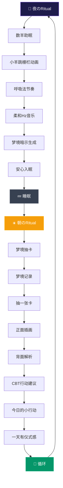

# 🌙☀️ REMia Day/Night Ritual Flow

## 昼夜循環のRitual Loop設計

## 🎯 核心价值主张

**"REMia 是一款让你晚上安心入睡，早晨带来启示的梦境伴侣 App。"**

### 🌙 夜のRitual - 数羊助眠
- **触发点**: 睡前焦虑、难入睡
- **体验**: 小羊跳栅栏动画 + 呼吸法节奏 + 柔和Hz音乐
- **心理效果**: 放松、安心入眠
- **输出**: 梦境暗示（轻量化占い感）

### ☀️ 朝のRitual - 梦境抽卡
- **触发点**: 醒来后对梦的好奇、一天的期待
- **体验**: 梦境记录 + 抽卡 + 正面插画/背面解析
- **心理效果**: 梦被赋予意义 → 行为建议 → 一天有仪式感
- **输出**: CBT行动建议 + 今日的小行动

## 🔄 形成「昼夜闭环」

### 用户价值
- **晚上**: 帮助缓解 **睡眠/焦虑痛点**
- **早上**: 帮助提供 **动力/意义感**
- **整体**: "睡前有陪伴，醒来有指引" → 日活留存高

### 心理机制
1. **睡前焦虑缓解** → 数羊助眠
2. **梦境意义化** → 抽卡解析
3. **行为指导** → CBT建议
4. **仪式感建立** → 日常习惯

## 🎨 设计要素

### 视觉设计
- **夜のテーマ**: 深い紫・青系、月・星のモチーフ
- **朝のテーマ**: 暖かいオレンジ・黄色系、太陽・光のモチーフ
- **共通要素**: ガラスモーフィズム、透明感、美しいアニメーション

### 交互设计
- **夜のRitual**: 呼吸に合わせた小羊アニメーション
- **朝のRitual**: カードフリップ、スワイプ操作
- **共通**: 直感的なタッチ操作、滑らかなアニメーション

## 📊 成功指标

### 用户行为指标
- **夜のRitual完成率**: 数羊助眠の完了率
- **朝のRitual完成率**: 梦境抽卡の完了率
- **昼夜循环率**: 連続使用日数
- **日活留存率**: 7日・30日留存率

### 心理効果指标
- **睡眠质量改善**: 睡眠時間・質の向上
- **焦虑缓解**: 睡前焦虑の軽減
- **意义感提升**: 梦境解析の満足度
- **行为改变**: CBT建议の実行率

## 🚀 実装優先度

### Phase 1: 核心Ritual
1. **数羊助眠**: 小羊アニメーション + 呼吸法
2. **梦境抽卡**: カードフリップ + 解析表示
3. **昼夜循环**: 基本的な使用フロー

### Phase 2: 体验优化
1. **Hz音乐**: 432/528/963Hz音源
2. **梦境暗示**: AI生成の軽量化占い
3. **CBT建议**: 心理学ベースの行动建议

### Phase 3: 深度功能
1. **SR系统**: 同步率の可視化
2. **个性化**: ユーザーに合わせたカスタマイズ
3. **社区功能**: 梦境分享・交流

## 💡 创新点

### 技术创新
- **昼夜循环设计**: 24時間の完璧なritual loop
- **心理学融合**: CBT + 梦境解析 + 呼吸法
- **AI个性化**: 梦境内容に基づく個別化

### 体验创新
- **仪式感建立**: 日常習慣としての定着
- **情感陪伴**: 睡前・醒後の情感支持
- **意义赋予**: 梦境の意味化・行動化

---

**REMia: 让你晚上安心入睡，早晨带来启示的梦境伴侣 App** 🌙☀️✨
